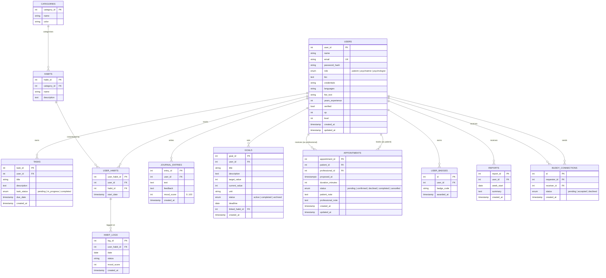

# GrowFlow — Entity-Relationship Diagram

The Mermaid block below renders directly on GitHub. It is the source of truth
for the data model; if you add or remove an entity, update this file.



## Reading the diagram

- `USERS` is the central entity. `role` discriminates patients from
  professionals; the same table holds both. Professionals additionally
  populate `bio / credentials / languages / fee_text / years_experience /
  verified`.
- `APPOINTMENTS` is the one place where a single user appears in two roles
  on the same row — `patient_id` and `professional_id` both point at
  `users.user_id`. Both relations cascade on user delete.
- `HABITS` is a *catalog* (shared across users). `USER_HABITS` is the
  per-user assignment. Daily check-ins attach to `USER_HABITS`, not directly
  to `HABITS`, so the catalog stays clean.
- `verified` defaults to `false` on register. Flip via the admin endpoint
  (`PATCH /api/v1/admin/professionals/:id/verify`).

## Cardinality summary

```
1 user           ── owns ──▶  ∞ tasks
1 user           ── owns ──▶  ∞ journal_entries
1 user           ── owns ──▶  ∞ goals
1 user           ── owns ──▶  ∞ user_habits     ── owns ──▶  ∞ habit_logs
1 user (patient) ── books ─▶  ∞ appointments    ── targets ──▶ 1 user (professional)
1 habit catalog  ── used by ▶ ∞ user_habits
```
